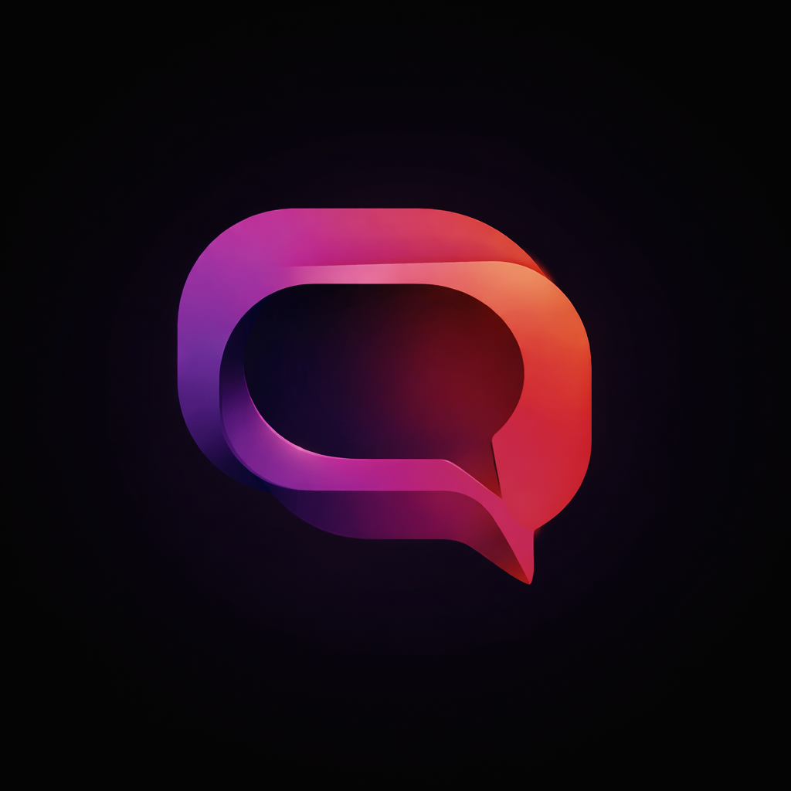

  
  
  # Goorac Quantum
  **Next-Generation Messaging and Social Ecosystem**

---

## 🌐 Overview

**Goorac Quantum** is a proprietary, highly scalable messaging and social media platform developed by Goorac Corporation. Engineered for seamless communication and rich social interaction, Quantum integrates state-of-the-art backend architecture with a built-in intelligent AI assistant, delivering a fast, secure, and modern digital experience.

## 🏢 Corporate Leadership

**Goorac Corporation** is dedicated to building robust, innovative software solutions that redefine digital communication and user connectivity. 

* **Chief Executive Officer:** Siva Manihandan
* **Organization:** Goorac Corporation

Under executive leadership, Goorac Corporation leverages advanced technologies to ensure Quantum remains a highly performant, secure, and industry-leading application.

---

## ⚠️ Legal, Copyright & Licensing

**STRICTLY CONFIDENTIAL AND PROPRIETARY**

This repository, including all source code, architectural documentation, algorithms, and UI/UX assets, is the sole and exclusive intellectual property of **Goorac Corporation**. 

* **License Status:** Closed-Source / Private Software
* **Copyright:** © 2026 Goorac Corporation. All Rights Reserved.
* **Prohibited Actions:** You may not copy, reproduce, distribute, publish, display, perform, modify, create derivative works, transmit, or in any way exploit any part of this code or documentation.
* **Unauthorized Access:** This software is not open source. Access is strictly restricted to authorized developers and personnel under active Non-Disclosure Agreements (NDAs). Any unauthorized access, use, or distribution is strictly prohibited and subject to immediate legal action.

If you have gained access to this repository in error, you must immediately destroy all local copies and purge the files from your system.

---

## 🛠️ Usage & Documentation

*Note: Access to Goorac Quantum deployment environments requires valid internal authentication.*

For authorized engineering teams, full technical documentation, Firebase backend configurations, API specifications, and deployment protocols are maintained exclusively on the secure Goorac Corporation internal engineering portal.
